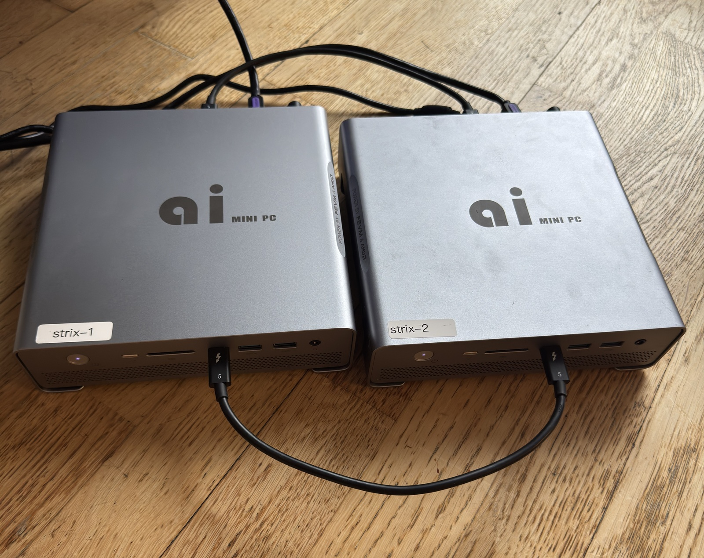
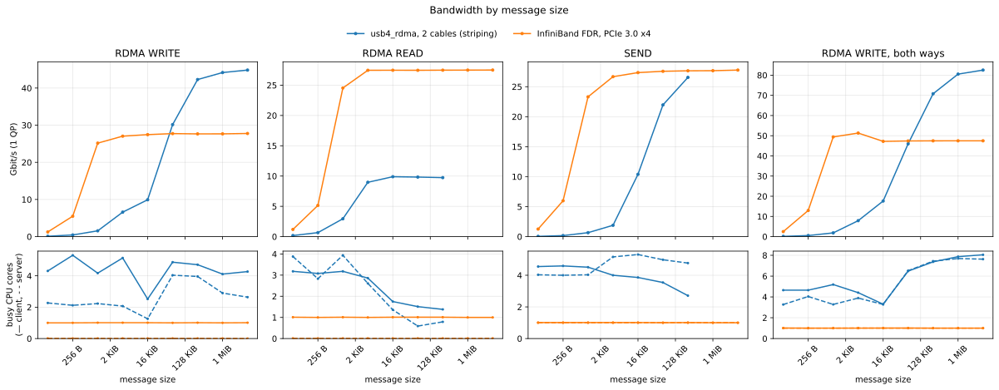
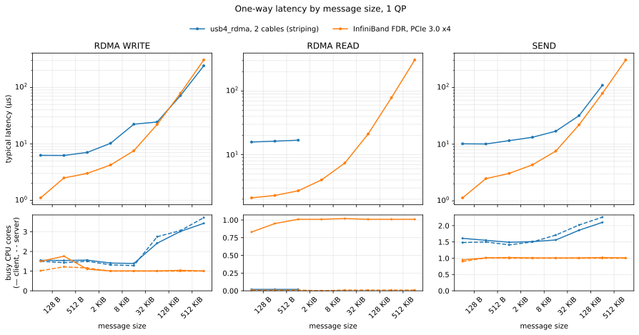

# thunderbolt-ibverbs

[](https://hydra.hellas.ai/job/hellas/thunderbolt-ibverbs/x86_64-linux.thunderbolt-ibverbs)

*** WARNING ***

this is a research driver. It is buggy, it is insecure, it is not for production.
for context, narrative, notes and benchmarks see the Hellas blog post:
https://blog.hellas.ai/blog/thunderbolt-ibverbs/

## what is it?
a linux kernel module + userspace shim to emulate an InfiniBand RDMA verb device across generic usb4/thunderbolt4 DMA rings



## does it work?
yes! obviously not as well as real hardware, but better than onboard ethernet and lower latency than RXE-over-`thunderbolt-net`

The charts measure one QP (queue pair: an RDMA connection's send and receive
queues, the unit an application posts its reads, writes and sends to) per
test, with write striping spreading that QP over four rails.

For tensor-parallel inference RDMA WRITE is the verb that counts: gufo's TP
exchanges use RDMA WRITE with immediate only, and NCCL/RCCL (as used by vLLM
across hosts) typically moves its data with RDMA WRITEs as well. RDMA READ
matters for stacks such as UCX, whose rendezvous protocol fetches large
messages with READs; READs are limited here (see
[known limits](docs/IMPROVEMENTS.md#known-limits)).





How these charts are made: [bench/README.md](bench/README.md#readme-charts).

## does it do anything useful?
with my two 128GB devices, i can:

 - perform inference at ~20 tok/s on a 230B-param MoE model that doesn't fit on a single device — ~30% faster than running the same TP=2 split over TCP-over-Thunderbolt ([MiniMax-M2.7 TP=2 on 2× Strix Halo](https://blog.hellas.ai/blog/thunderbolt-ibverbs/5-closing/))
 - make batch=1 inference go faster with TP=2 than single node ([Llama-3.1-8B solo vs TP=2 4-HCA RDMA](https://blog.hellas.ai/blog/thunderbolt-ibverbs/4-thunderbolt-ibverbs/#vllm-benchmarks))
 - full finetune a 12b param model 11x faster than ethernet ([Gemma 3 12B full FSDP train wall time](https://blog.hellas.ai/blog/thunderbolt-ibverbs/4-thunderbolt-ibverbs/#finetune))

## i can do that better by doing xyz..
okay

## is it slop?
i guess

## how do i use it?
tell your agent- check out github.com/hellas-ai/thunderbolt-ibverbs and find out how we can use it

## no, really, how do i use it?
at a high level:

1. load the kernel module on the host (instructions per OS in [Install From GitHub Releases](#install-from-github-releases) below) — creates an IB device in `/sys/class/infiniband` per visible HCA
2. connect usb4 cables between hosts
3. run your workload against the device

## run inside a stock pytorch / vllm / llama.cpp container

the kernel module stays on the host. inside the container you just need our libibverbs provider so the stock `libibverbs.so` enumerates the device. drop the .deb in for your container's ubuntu codename:

```sh
docker run --rm -it \
    --device=/dev/infiniband \
    --cap-add=IPC_LOCK --ulimit memlock=-1 \
    pytorch/pytorch:latest bash

# inside the container — pick .jammy for ubuntu 22.04, .noble for 24.04:
apt install -y ibverbs-utils \
    https://github.com/hellas-ai/thunderbolt-ibverbs/releases/latest/download/usb4-rdma-provider_0.3.0.jammy_amd64.deb

ibv_devices
# device          	   node GUID
# ------          	----------------
# usb4_rdma0      	...
```

NCCL / UCX / perftest inside the container then see `usb4_rdma*` as a normal IB device.

if you want a batteries-included image with vllm / llama.cpp / rdma-core-usb4 / perftest already baked in (heavier — a few GB), use the ibverbs-enabled docker images from [github.com/hellas-ai/nix-strix-halo](https://github.com/hellas-ai/nix-strix-halo).

## that sounds complicated, is there any easier way?
sure, download and write the usb-bootable image from here, insert it into your machines, hit f11 while its booting to select the usb stick

For a repeatable two-node vLLM transport smoke, use the packaged bench helper.
It starts Ray, runs a tiny TP=2 vLLM workload, captures
`/sys/kernel/debug/thunderbolt_ibverbs/summary` before/after, and fails if the
TP run completes without moving RDMA counters:

```sh
tbv_vllm_smoke.sh \
  --hosts 192.168.23.136,192.168.23.192 \
  --iface eno1 \
  --transport native \
  --hca usb4_rdma5 \
  --wrapper /path/to/vllm-env \
  --require-rdma auto
```

## Status

- Native Linux-to-Linux verbs transport is the main path.
- Apple-compatible transport exists, but is still experimental.
- The module builds against stock kernels, but needs Linux 6.14 or newer
  (or this flake's `linux-thunderbolt` kernel) for the maintainer-tree
  Thunderbolt/USB4 subsystem changes it relies on.
- `nhi_interrupt_throttle_ns` is active only on kernels that export
  `tb_ring_throttling()`.
- The Nix flake builds a Thunderbolt testing kernel from the maintainer
  `next` branch with the local kernel patches applied.
- Debian, Fedora, Arch, and Nix builds are exercised in CI.

## License

The kernel module is licensed under GPL-2.0-only, matching the SPDX tags in the
kernel sources and `MODULE_LICENSE("GPL")`.

Small userspace-facing test and protocol helper files that say
`GPL-2.0 OR BSD-3-Clause` may be used under either license.

## Install From GitHub Releases

Pre-built DKMS source packages are attached to GitHub Releases:

  https://github.com/hellas-ai/thunderbolt-ibverbs/releases

Each release ships two packages per distro: the DKMS source package for the
kernel module, and a userspace libibverbs provider so `ibv_devices` and
downstream RDMA tools (NCCL, perftest, vllm) enumerate the device.

```sh
# Debian or Ubuntu (needs Linux 6.14+)
sudo apt install \
    ./thunderbolt-ibverbs-dkms_<ver>_all.deb \
    ./usb4-rdma-provider_<ver>_amd64.deb

# Fedora
sudo dnf install \
    ./thunderbolt-ibverbs-dkms-<ver>-1.noarch.rpm \
    ./usb4-rdma-provider-<ver>-1.x86_64.rpm

# Arch
sudo pacman -U \
    ./thunderbolt-ibverbs-dkms-<ver>-1-any.pkg.tar.zst \
    ./usb4-rdma-provider-<ver>-1-x86_64.pkg.tar.zst
```

DKMS builds the kernel module against your running kernel on install and
rebuilds it after every kernel upgrade. Older kernels need the
`linux-thunderbolt` build from this flake — see "Nix Thunderbolt Kernel" below.

## Requirements

Install matching kernel headers and the basic module build tools.

Debian or Ubuntu:

```sh
sudo apt install build-essential dkms git kmod "linux-headers-$(uname -r)" rdma-core perftest
```

Fedora:

```sh
sudo dnf install dkms gcc git kernel-devel kernel-headers kmod make rdma-core perftest
```

Arch Linux:

```sh
sudo pacman -S --needed base-devel dkms git kmod linux-headers rdma-core perftest
```

## Install With DKMS

```sh
git clone https://github.com/hellas-ai/thunderbolt-ibverbs.git
cd thunderbolt-ibverbs

sudo make dkms-add
sudo make dkms-build
sudo make dkms-install
```

After a kernel upgrade, DKMS should rebuild the module for the new kernel.

To remove it:

```sh
sudo make dkms-remove
```

## Keeping thunderbolt-net off the links

When a peer offers its network service, distributions load `thunderbolt_net`
automatically (by modalias) as soon as a cable is plugged in. It then takes a
DMA ring of each USB4 controller, which has only two for data, so this module
gets fewer rails or none; loaded afterwards, `thunderbolt_net` fails with
`failed to allocate Tx ring` and does no harm. `tbnet=` only sets this
module's own behavior and does not keep `thunderbolt_net` away. Only root
can, with `/etc/modprobe.d/`; `blacklist` stops the automatic load (an
explicit `modprobe thunderbolt_net` still works, and IP over Thunderbolt is
gone while it is blacklisted).

A persistent setup, here with the module installed by DKMS and a dummy
netdev for the RoCE addresses (use a different address on the other host):

```text
# /etc/modprobe.d/thunderbolt-ibverbs.conf
blacklist thunderbolt_net
options thunderbolt_ibverbs profile=linux_perf tbnet=prefer_rdma lanes=2 register_verbs=1 roce_netdev=tbv0 native_write_striping=1
# the RoCE netdev has to exist before the rails register
install thunderbolt_ibverbs /usr/sbin/ip link show tbv0 >/dev/null 2>&1 || { /usr/sbin/ip link add tbv0 type dummy && /usr/sbin/ip addr add 10.77.0.1/24 dev tbv0 && /usr/sbin/ip link set tbv0 up; }; /usr/sbin/modprobe --ignore-install thunderbolt_ibverbs $CMDLINE_OPTS

# /etc/modules-load.d/thunderbolt-ibverbs.conf
thunderbolt_ibverbs
```

rdma-core's udev rule `60-rdma-persistent-naming.rules` renames RDMA devices
by bus path (`rocep...`), but the `usb4_rdma` provider finds its devices by
name. Copy the rule to `/etc/udev/rules.d/` and exclude them:
`KERNEL!="hfi1*", KERNEL!="usb4_rdma*", PROGRAM="rdma_rename %k NAME_FALLBACK"`.

## Checking the link speed

Each rail can only be as fast as its link, and USB4 links do not always train
at full speed. Check both ends after plugging in or booting:

```sh
for d in /sys/bus/thunderbolt/devices/*-*; do
  [ -e "$d/rx_speed" ] && echo "$(basename "$d") rx $(cat "$d/rx_speed") x $(cat "$d/rx_lanes")" \
    "tx $(cat "$d/tx_speed") x $(cat "$d/tx_lanes")"
done
```

A full-speed USB4 40 Gb/s link shows `20.0 Gb/s` on 2 lanes each way; a
link that trained down shows `10.0 Gb/s`, or 1 lane. Between two Strix Halo
hosts, links came up at 10 Gb/s per lane after boot or the first plug more
than once, and trained at 20 Gb/s after unplugging and plugging the cable
again. `nix run .#tbv-perftest` checks this before a run with
`--expect-speed 20Gb/s`.

## Build Without DKMS

For a one-off build against the running kernel:

```sh
make KVER="$(uname -r)"
sudo make KVER="$(uname -r)" modules_install
sudo depmod -a
```

## Nix

Build the module package:

```sh
nix build github:hellas-ai/thunderbolt-ibverbs#thunderbolt-ibverbs
```

Other flake outputs:

```sh
nix build github:hellas-ai/thunderbolt-ibverbs#rdma-core-usb4   # libibverbs + usb4_rdma provider
nix build github:hellas-ai/thunderbolt-ibverbs#perftest         # ib_write_bw/ib_send_bw/... linked against rdma-core-usb4
nix build github:hellas-ai/thunderbolt-ibverbs#bench-tools      # u4_pingpong, uc_oneway, rc_write_*, tbv_perftest_runner, etc.
```

`nix develop` drops you in a shell with the module headers, `rdma-core-usb4`,
`perftest`, and the bench tools on PATH.

For benchmark hosts that need SSH aliases or a jump host, pass an SSH config to
the generated runner:

```sh
nix run .#tbv-perftest -- \
  --ssh-config /tmp/tbv_ssh_config \
  --hosts goblin,mbp-tb \
  --data-addrs goblin=192.168.0.1,mbp-tb=192.168.0.2
```

On NixOS, add the flake input and import the module:

```nix
{
  inputs.thunderbolt-ibverbs.url = "github:hellas-ai/thunderbolt-ibverbs";

  outputs = { nixpkgs, thunderbolt-ibverbs, ... }: {
    nixosConfigurations.host = nixpkgs.lib.nixosSystem {
      system = "x86_64-linux";
      modules = [
        thunderbolt-ibverbs.nixosModules.default
        {
          hardware.thunderbolt-ibverbs.enable = true;
        }
      ];
    };
  };
}
```

Downstream flakes can compose the package set through the default overlay:

```nix
{
  nixpkgs.overlays = [
    thunderbolt-ibverbs.overlays.default
  ];
}
```

The overlay provides `rdma-core-usb4`, `thunderbolt-ibverbs`,
`thunderbolt-ibverbs-perftest`, and `thunderbolt-ibverbs-bench-tools` on Linux.

## Load And Use

Connect the Thunderbolt/USB4 hosts first. On both Linux peers, load the module
with the native Linux transport enabled:

```sh
sudo modprobe thunderbolt_ibverbs \
  profile=linux_perf \
  bind_services=1 \
  allocate_rings=1 \
  start_rings=1 \
  negotiate_native=1 \
  enable_tunnels=1 \
  register_verbs=1
```

If userspace needs a RoCE netdev for GID metadata, pass one explicitly:

```sh
sudo modprobe thunderbolt_ibverbs \
  profile=linux_perf \
  bind_services=1 allocate_rings=1 start_rings=1 \
  negotiate_native=1 enable_tunnels=1 register_verbs=1 \
  roce_netdev=thunderbolt0
```

Check that the device registered:

```sh
dmesg | grep thunderbolt_ibverbs
ibv_devices
rdma link
```

With `perftest` installed, select the reported RDMA device explicitly:

```sh
# peer A
ib_write_bw -d usb4_rdma0

# peer B
ib_write_bw -d usb4_rdma0 <peer-a-address>
```

Unload the module before changing static load parameters:

```sh
sudo modprobe -r thunderbolt_ibverbs
```

To make a known-good configuration persistent, put the options in
`/etc/modprobe.d/thunderbolt-ibverbs.conf`.

## Useful Parameters

```text
profile=linux_perf|mac_compat|mixed
tbnet=auto|allow|prefer_rdma|block
lanes=auto|N|MIN-MAX
register_verbs=0|1
native_wr_striping=0|1
native_fragment_striping=0|1
native_write_striping=0|1
native_write_stripe_min_bytes=<bytes>
native_domain_mask=<mask>
zcopy_min_bytes=<bytes>
qp_timeout_ms=<ms>
nhi_interrupt_throttle_ns=<ns>
```

Run `make -C kernel help` for the full parameter list.

### One QP across rails

By default a QP's data stays on one rail, so an application that uses a
single QP gets one DMA ring's worth of bandwidth (about 10 Gbit/s).
`native_write_striping=1` cuts every RDMA WRITE of at least
`native_write_stripe_min_bytes` (default 64 KiB) into one contiguous block per
rail; the receiver places each fragment directly and completes the WRITE in
order. It also turns on `native_fragment_striping` for SENDs, which share the
ordered receive path. The rails of every link to the same host form one
pool, so a second cable adds its rails; `native_domain_mask` limits native
rails to some USB4 controllers (bit n = domain n). Both hosts need the same
build. For two cables between two Strix Halo hosts:

```text
profile=linux_perf tbnet=prefer_rdma lanes=2 register_verbs=1 native_write_striping=1
```

Example: tensor parallelism (TP=2) of [gufo](https://github.com/gufo-org/gufo)
over two cables, with its RDMA transport from the `rdma` branch of
[neuhaus/gufo](https://github.com/neuhaus/gufo/tree/rdma) (upstream in review).
gufo exchanges each layer's partial results with one QP and
RDMA WRITE with immediate, so it relies on write striping. RoCE addressing
needs a netdev with an IPv4 address; a dummy one per host is enough:

```sh
# both hosts (10.77.0.2 on the second)
sudo ip link add tbv0 type dummy
sudo ip addr add 10.77.0.1/24 dev tbv0 && sudo ip link set tbv0 up
sudo modprobe thunderbolt_ibverbs profile=linux_perf tbnet=prefer_rdma \
  lanes=2 register_verbs=1 roce_netdev=tbv0 native_write_striping=1

# any rail device will do; its QP stripes over all four rails
ibv_devices
gufo serve llm --model MODEL.gguf --tp-world-size 2 --tp-rank 0 \
  --tp-bootstrap-port 18515 --tp-control-port 18516 \
  --tp-control-token SHARED_TOKEN --tp-rdma-device usb4_rdma0
gufo serve llm --model MODEL.gguf --tp-world-size 2 --tp-rank 1 \
  --tp-bootstrap-host RANK0_ADDRESS --tp-bootstrap-port 18515 \
  --tp-control-port 18516 --tp-control-token SHARED_TOKEN \
  --tp-rdma-device usb4_rdma0
```

Measured this way (Qwen3.8 Flash-Next Q4, 25.8k-token prompt), prefill ran
at 1824 tok/s against 1892 over FDR InfiniBand, with identical output.

`/sys/kernel/debug/thunderbolt_ibverbs/summary` counts striped WRITEs
(`data_wr_block_split`) and frames lost on a path (`data_rx_lost`; their
credits are refunded and retransmission recovers the message).
`peers` shows each rail's credits and, on `tx_pump`, why queued frames are
not being sent. What this branch changes and measures:
[docs/IMPROVEMENTS.md](docs/IMPROVEMENTS.md).

## Nix Thunderbolt Kernel

The module loads on stock kernels. For the maintainer-tree USB4 work, the flake
also exposes `linux-thunderbolt`: nixpkgs' `linuxPackages_testing.kernel` with
only the source, version, and kernel patch list overridden. It uses the nixpkgs
testing kernel configuration, not a machine-local config.

```sh
nix build .#linux-thunderbolt
nix build .#thunderbolt-ibverbs-linux-thunderbolt
```

On NixOS, use that kernel package set and enable the module:

```nix
{ pkgs, inputs, ... }:
let
  system = pkgs.stdenv.hostPlatform.system;
  tbv = inputs.thunderbolt-ibverbs.packages.${system};
in {
  boot.kernelPackages = pkgs.linuxPackagesFor tbv.linux-thunderbolt;
  hardware.thunderbolt-ibverbs.enable = true;
}
```

Hydra evaluates the same path through
`hydraJobs.x86_64-linux.linux-thunderbolt` and
`hydraJobs.x86_64-linux.thunderbolt-ibverbs-linux-thunderbolt`.
